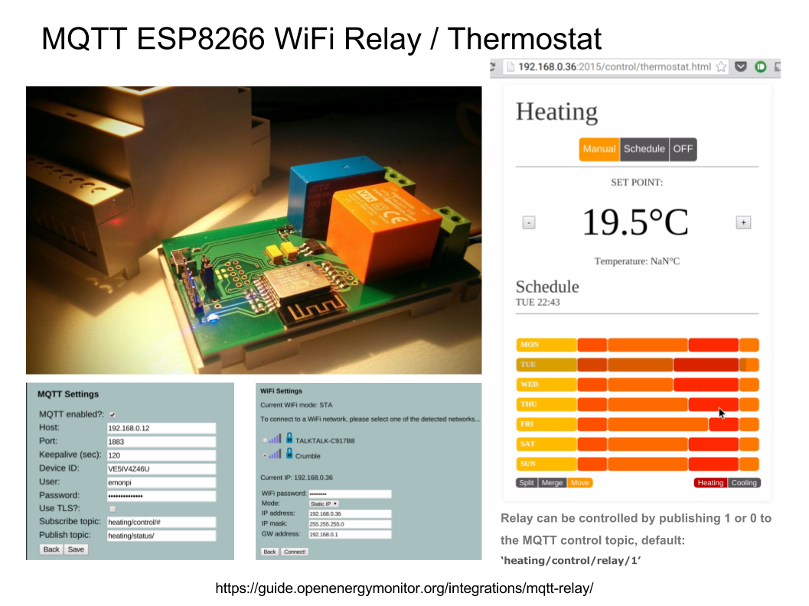
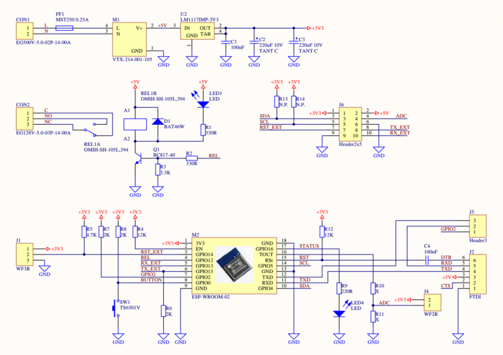

## WiFi ESP8266 MQTT Relay: Single Channel 

This repo contains the production compiled firmware, bootloader and schematic for the single-channel Wifi relay sold via the OpenEnergyMonitor shop. 

## Shop Item

http://shop.openenergymonitor.com/wifi-mqtt-relay-thermostat/

## User Guide Docs

https://guide.openenergymonitor.org/integrations/mqtt-relay/

***

*Unfortnatly the source code and CAD design is not available for this unit. However the unit is very similar to the open-source [Three Channel MQTT Relay](https://github.com/mharizanov/ESP8266_Relay_Board) that we have [adapted to work in single channel mode](https://github.com/openenergymonitor/ESP8266_Relay_Board).*
